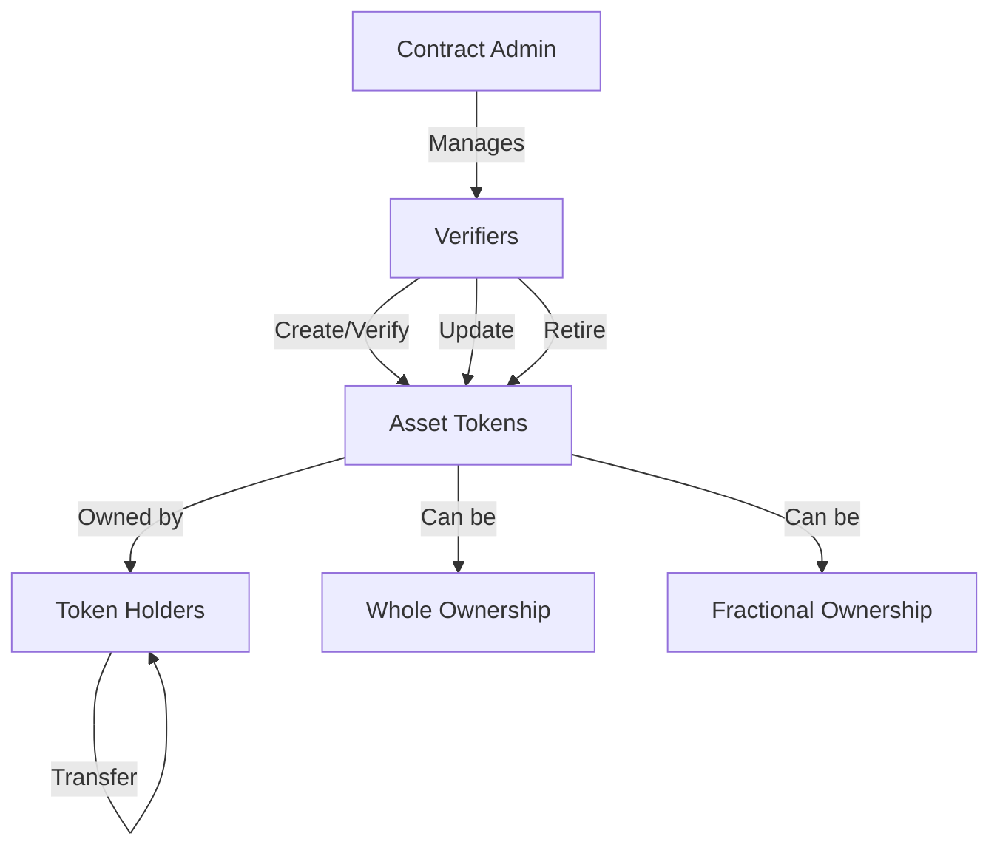

# Asset Chain Tokenization Platform (ChainMint)

A comprehensive solution for tokenizing physical assets on the Stacks blockchain, enabling the creation of digital representations of real-world items with verified ownership records.

## Overview

ChainMint provides a robust platform for tokenizing physical assets such as real estate, art, commodities, and collectibles on the blockchain. The platform features:

- Asset creation and verification by authorized entities
- Comprehensive metadata and ownership tracking
- Support for both whole and fractional ownership
- Immutable audit trail of all transfers and modifications
- Flexible ownership transfer mechanisms
- Secure administrative controls

## Architecture

The platform is built around a primary smart contract that manages the entire lifecycle of tokenized assets.



### Core Components

1. **Asset Registry** - Stores comprehensive asset metadata and verification status
2. **Ownership Tracking** - Manages current ownership and ownership percentages
3. **Transfer System** - Handles ownership transfers with audit trail
4. **Access Control** - Manages admin and verifier permissions

## Contract Documentation

### Asset Tokenizer Contract

The main contract managing all asset tokenization operations.

#### Key Features

- Asset creation and verification
- Ownership management
- Transfer functionality
- Administrative controls
- Metadata management

#### Access Levels

- **Contract Admin**: Can manage verifiers and contract settings
- **Verifiers**: Can create/verify assets and update metadata
- **Asset Owners**: Can transfer their owned assets
- **Public**: Can view asset information

## Getting Started

### Prerequisites

- Clarinet CLI tool
- Stacks wallet for deployment and interaction

### Installation

1. Clone the repository
2. Install dependencies with Clarinet
3. Deploy the contract to desired network

```bash
clarinet deploy --network [testnet/mainnet]
```

## Function Reference

### Administrative Functions

```clarity
(set-contract-admin (new-admin principal))
(set-verifier (verifier-address principal) (authorized bool))
```

### Asset Management

```clarity
(create-asset (name (string-ascii 64)) 
              (description (string-utf8 500))
              (asset-type (string-ascii 32))
              (location (string-utf8 256))
              (metadata-uri (string-ascii 256))
              (is-fractional bool)
              (initial-owner principal))

(verify-asset (asset-id uint) (verification-status (string-ascii 20)))

(update-asset-metadata (asset-id uint)
                      (name (optional (string-ascii 64)))
                      (description (optional (string-utf8 500)))
                      (location (optional (string-utf8 256)))
                      (metadata-uri (optional (string-ascii 256))))
```

### Transfer Functions

```clarity
(transfer-asset (asset-id uint) (recipient principal))
(transfer-fractional (asset-id uint) (recipient principal) (percentage uint))
```

### Query Functions

```clarity
(get-asset (asset-id uint))
(get-asset-ownership (asset-id uint))
(get-ownership-percentage (asset-id uint) (owner principal))
```

## Development

### Testing

Run the test suite using Clarinet:

```bash
clarinet test
```

### Local Development

1. Start a local Clarinet console:
```bash
clarinet console
```

2. Deploy the contract:
```clarity
(contract-call? .asset-tokenizer ...)
```

## Security Considerations

### Access Control
- Only authorized verifiers can create and verify assets
- Only asset owners can transfer their assets
- Admin functions are protected by admin-only checks

### Ownership Management
- Ownership percentages are tracked in basis points (1/100th of a percent)
- Total ownership must always equal 100%
- Transfers are validated against current ownership

### Known Limitations
- Maximum of 20 owners per asset
- Asset names limited to 64 ASCII characters
- Descriptions limited to 500 UTF-8 characters
- Metadata URIs limited to 256 characters

### Best Practices
- Verify asset ownership before initiating transfers
- Keep private keys secure for admin and verifier accounts
- Monitor transfer events for suspicious activity
- Regular verification of asset metadata accuracy